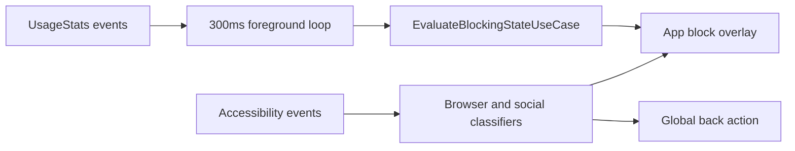
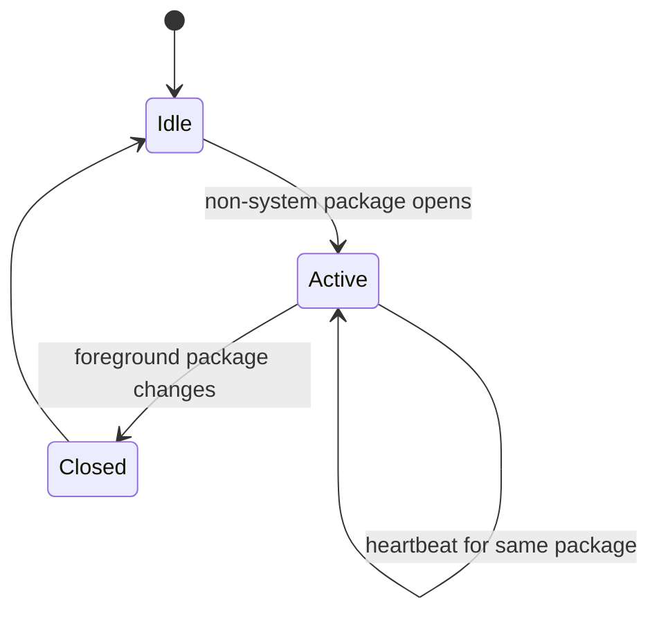

## Verification Scope

This analysis is based on the current Mostaqeem repository, now represented publicly as Rafiqy. It describes what the code does, including its constraints. Battery impact, OEM behavior, and bypass resistance require device measurements and are not presented here as proven outcomes.

## Why Two Detection Engines Exist

App-level blocking and content-level blocking are different problems.

The `:service:main` module answers **which package is in the foreground**. `AppForegroundRepositoryImpl` queries recent `UsageEvents` inside an infinite `Dispatchers.IO` loop with a 300ms delay. That package name enters `EvaluateBlockingStateUseCase`, where app, schedule, and duration rules produce a `BlockingDecision`.

The `:feature:service` module answers **which surface is visible inside another app**. `MosAccessibilityService` reacts to window content, window state, and text changes. It inspects browser address bars and selected social app view hierarchies, then leaves blocked content with `GLOBAL_ACTION_BACK` or opens a blocking overlay.

Keeping these engines separate prevents every foreground-app tick from traversing an accessibility tree. It also keeps package rules independent from app-specific view identifiers.

## The Foreground Service Path

`com.mostaqeem.service.main.Service` is a `LifecycleService` registered with the `specialUse` foreground-service type. It starts with a persistent notification and collects foreground-package changes.

The blocking flow is:

1. `UsageStatsManager.queryEvents()` scans a two-second lookback window.
2. The repository keeps activity-resumed or move-to-foreground events.
3. The current package enters `EvaluateBlockingStateUseCase`.
4. Rule collectors evaluate app membership, duration, and schedules.
5. A block decision launches the main `OverlayActivity` with a new task.

The overlay redirects back navigation to the launcher rather than returning directly to the blocked app.

## Session Tracking Is a State Machine

`SessionTrackingManager` listens to the same foreground stream but has a different responsibility. It excludes launchers and system packages, starts a Room session when a user app becomes active, updates its last-active time while the same app remains foreground, and closes the session when the package changes.

This separation matters: blocking policy can change without changing usage accounting, and session storage can evolve without coupling itself to overlay behavior.

## Accessibility Interception

Browser interception uses `SupportedBrowserConfig` to map supported packages to their address-bar view IDs. The service normalizes the captured domain, checks user-blocked domains and `HarmfulRepository`, redirects blocked pages to a safe blank URL, and launches the website block overlay.

Social classifiers use view identifiers and structural hints:

- YouTube Shorts checks for `reel_recycler`.
- Instagram checks clips/reels containers.
- TikTok checks obfuscated "aweme" nodes and vertical pagers.
- Facebook distinguishes reels/video surfaces from stories.

This is fast to deploy but operationally fragile. A social app can rename or restructure its views without notice, causing a classifier to fail until the detector is updated.

## Recovery Model

Mostaqeem has three recovery layers:

- `ServiceCheckerWorker` runs every 16 minutes to verify the foreground service.
- `BootCompletedReceiver` starts the service and schedules the worker after reboot.
- The permission UI requests exemption from battery optimization.

These layers improve continuity, but they do not establish zero battery cost or universal OEM reliability.

## Architectural Trade-offs

| Decision | Benefit | Cost |
| --- | --- | --- |
| 300ms UsageEvents loop | Low-latency package changes | Continuous CPU and battery work |
| Accessibility classifiers | Content-specific interception | Fragile external view IDs |
| Two overlay activities | Module independence | Duplicated dismissal behavior |
| Boot + periodic recovery | Better persistence | More system integration and permission friction |

The reusable lesson is not "poll faster." It is to isolate detection, policy evaluation, enforcement, and accounting so each can be measured and replaced independently.

