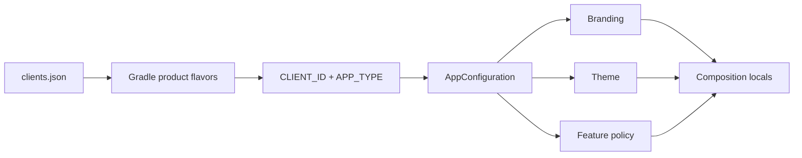

## Verification Scope

The current repository contains 18 client records and no repository-level CI workflow. This article covers verified flavor generation and runtime configuration. It does not claim automated store delivery, a tag-triggered release pipeline, or a larger variant count than the source registry contains.

## The Configuration Boundary

Schoolie keeps client identity in `clients/clients.json`. During Gradle configuration, `app/build.gradle.kts` parses that list with `JsonSlurper` and registers one product flavor per client.

```kotlin
val clientsJsonFile = rootProject.file("clients/clients.json")
val clients = (JsonSlurper().parse(clientsJsonFile) as List<*>)
    .filterIsInstance<Map<String, Any>>()

productFlavors {
    clients.forEach { client ->
        register(client["id"] as String) {
            dimension = "client"
            applicationIdSuffix = client["applicationIdSuffix"] as String
            versionCode = client["versionCode"] as Int
            versionName = client["versionName"] as String
            buildConfigField("String", "CLIENT_ID", "\"${client["id"]}\"")
            buildConfigField("String", "APP_TYPE", "\"${client["type"]}\"")
        }
    }
}
```

The registry owns identity and version data. It does not attempt to serialize the entire application graph into JSON.

## Compile-Time Identity, Runtime Policy

`Schoolie`, the application class, initializes `AppConfiguration` from `BuildConfig.CLIENT_ID`, `BuildConfig.APPLICATION_ID`, and `BuildConfig.APP_TYPE`.

That identity is resolved through three runtime models:

- `BrandingConfiguration`: name, icon, logo, support details, and descriptive copy.
- `ThemeConfiguration`: brand-specific light and dark palettes.
- `FeatureConfiguration`: product-type defaults plus client overrides.

Compose receives the result through `SchoolieTheme` and `CompositionLocalProvider`. Screens can read branding and feature policy without importing Gradle or parsing configuration files.



## Module and Dependency Shape

Schoolie uses an included `build-logic` build and feature modules partitioned into data, domain, and presentation boundaries. Core modules own networking, persistence, session state, configuration, date/time, upload infrastructure, and shared UI.

Koin annotations (`@Single`, `@KoinViewModel`, `@KoinWorker`) generate dependency declarations. The application `AppModule` includes core and feature modules at the composition root. Ktor remains inside network/data boundaries, and repository error mapping prevents Ktor exceptions from leaking into domain code.

## Background and Offline Work

The verified background workers are:

- `UploadWorker` for foreground media upload progress.
- `PostQueueWorker` for posts created while remote submission is pending.
- `ReactionSyncWorker` for deferred feed reactions.

Room version 12 stores 13 entities, including upload, feed post, post queue, and conversation data. This supports selected offline workflows; it does not prove every Schoolie feature is offline-first.

## Firebase Configuration

The repository uses one consolidated `app/google-services.json` containing entries for the configured application IDs, all pointing to the same Firebase project. This is simpler than copying one descriptor into every flavor source set, but the file must remain synchronized with the client registry.

## Risks Found in the Source

1. `fallbackToDestructiveMigration(true)` can erase feed, message, and pending queue data on an unhandled schema upgrade.
2. Dark mode is hardcoded off even though dark theme configuration exists.
3. Bearer token refresh code is commented out.
4. Client validation and full variant builds are not automated by a checked-in CI pipeline.
5. Configuration comments still contain unresolved client-specific TODOs.

The main architectural result is a clean boundary: Gradle establishes app identity, while typed runtime configuration controls product behavior. That boundary is reusable even before CI distribution is added.

