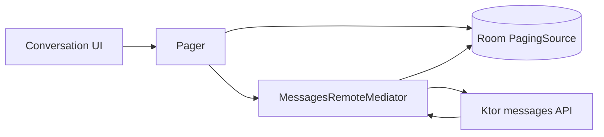

## Verification Scope

StudentWayParent has offline-readable students and messages, optimistic message sending, and realtime tracking. The repository does not contain an offline booking queue, booking worker, weekly cleanup worker, or transportation `RemoteMediator`. Those earlier claims are excluded.

## A 45-Module Product Boundary

`settings.gradle.kts` declares 45 modules. Twelve product areas use separate data, domain, and presentation modules. Shared concerns live in core network, database, domain, session, notifications, UI, and common modules, with an included `build-logic` build providing convention plugins.

This granularity gives each feature a narrow dependency surface. It also makes the app module a clear composition root instead of a container for implementation code.

## Students Are Scoped to the Active Account

`StudentsRepositoryImpl.observeStudents()` uses `flatMapLatest` on `SessionManager.sessionState`. An authenticated parent receives a Room Flow filtered by `ownerUserId`; any other session emits an empty list.

`UserDataSyncManager` is an eager Koin singleton. On account change it:

1. Clears the prior student cache.
2. Refreshes the profile.
3. Syncs wallet data.
4. Syncs students.
5. Syncs the home location.

Each sync runs in its own child coroutine, so one failed domain does not cancel the others. Failures are logged and the last successful Room state remains available.

## Messaging Uses Room as the Paging Source

The verified `RemoteMediator` belongs to messages.

`MessagesRepositoryImpl.observeMessages()` creates a `Pager` with:

- A `MessagesRemoteMediator` for network pages.
- A Room `PagingSource` for the rendered list.
- Page state persisted by owner and conversation ID.

On refresh, synchronized server messages are replaced. Appends upsert the next page. The mediator returns an error without deleting existing rows, so cached history remains visible.

## Optimistic Sending Has an Explicit Failure State

Sending a text message creates a local row with a `local-{UUID}` ID and `PENDING` delivery state. The conversation preview updates immediately.

If the server succeeds, the repository deletes the local row and inserts the server message. If the server fails, it marks the same local row `FAILED` and stores the failure reason.

This is honest optimistic UI: failure remains visible. It is not a durable outbox, because the current code does not schedule a worker to retry failed messages.

## Realtime Messages and Tracking Use Different Channels

Pusher private channels carry message-sent, message-updated, and typing events. The adapter wraps the subscription in `callbackFlow`, caches message events into Room, and disconnects in `awaitClose`.

Live vehicle tracking uses Firebase Realtime Database instead. Ktor first returns tracking configuration and route information; `TripTrackingRealtimeDataSource` attaches a `ValueEventListener` to the supplied database URL and path.

`TripTrackingViewModel` exposes Connecting, Reconnecting, and Disconnected states. Retry delays are 2, 4, 6, then 10 seconds, with a maximum of five retry attempts.

## Reliability Boundaries

1. Room version 6 uses destructive migration, which can erase cached and pending message state.
2. Account-driven sync is not a periodic WorkManager refresh.
3. Failed optimistic messages are visible but not automatically retried.
4. Live tracking stops after its bounded retry budget until the user retries.
5. Bearer refresh code is present but commented out; HTTP 401 logs out the active session.

The precise claim is stronger than a broad "offline-first" label: selected read paths survive network loss, messaging is optimistic with explicit failure, and realtime location has a bounded reconnection policy.

