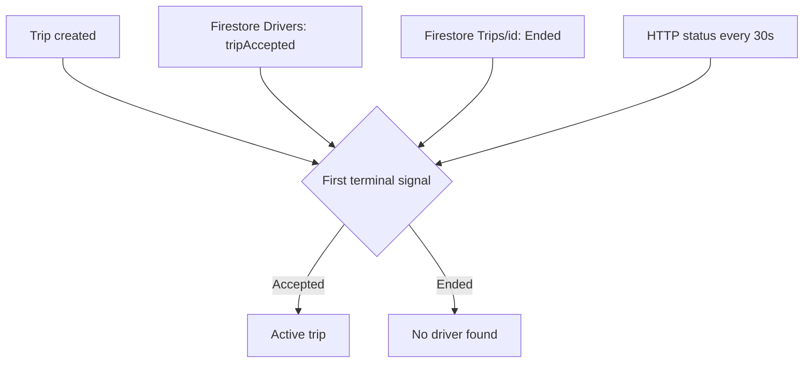

## Verification Scope

The repository verifies a three-module app/domain/data architecture and the current ride flow. It cannot establish a historical refactor timeline, deployment process, or user-impact metrics, so those claims are outside this article.

## One Ride, Two Transports

The passenger app uses Ktor for commands and full payloads, while Firestore carries fast-changing dispatch state.

- Ktor creates trips, fetches trip details, loads cancellation reasons, submits status-changing commands, and resolves routes.
- Firestore observes driver acceptance, dispatch termination, driver status, and driver coordinates.

This is a deliberate division of data shape. REST responses remain the authoritative domain payload; Firestore documents act as small realtime signals.

## Trip Creation Before Dispatch

`TripFlowViewModel` owns a multi-step Compose flow: pickup, destination, category, and searching. `TripFlowStatePersister` saves the current step, `TripParameters`, and optional trip ID in `SavedStateHandle`.

`CreateTripUseCase` validates location, address, payment, wallet balance, vehicle class, duration, and distance before calling `TripRepository.createTrip()`.

After a successful POST, it emits `TripCreated` and begins observing search resolution.

## Three Signals Race to Resolve Search

`ObserveTripSearchUseCase` merges three sources and applies `take(1)`:

1. A Firestore query against `Drivers` where `tripId` matches. `tripAccepted == true` means acceptance.
2. A Firestore listener on `Trips/{tripId}`. A nonzero `Ended` field means the search ended without a driver.
3. An HTTP call to `current-trip-status` every 30 seconds. Backend code 6 also means the search ended.

The HTTP poll is not the primary realtime transport. It is an independent fallback that can terminate a search if a Firestore update is missed.

## Active Ride State

`GetTripDetailsAndObserveStatusUseCase` fetches complete trip details over Ktor, then observes the assigned driver's Firestore document. It maps integer status values into:

- Pending
- OnTheWay
- Arrived
- Started
- ClientPaid
- TripEnd
- Canceled
- Failed

`ActiveTripViewModel` reduces each status into markers, camera behavior, cancellation policy, and navigation. It recalculates driver-to-pickup directions while the driver is on the way, then driver-to-destination directions after the ride starts.

## Location Collection

The passenger's own `LocationRepositoryImpl` wraps `FusedLocationProviderClient` in `callbackFlow`, requests high-accuracy updates at a 10-second interval, and removes the callback in `awaitClose`. Missing permission and disabled location services are explicit exceptions rather than empty coordinates.

## The Dormant Room Boundary

The data module declares `ActiveTripEntity`, `ActiveTripDao`, and a Room database. Koin constructs the database, but no production flow injects or calls that DAO.

That distinction is important: the schema suggests intended recovery, but the current ride flow is not Room-backed. Active recovery comes from backend `hasActiveTrip()`, Firestore, and restored navigation state.

## Failure Modes Worth Keeping Visible

1. When Firestore omits driver coordinates, the repository substitutes `Location(31.5, 32.65)`. A missing coordinate can therefore appear as a real map position.
2. Two overloaded trip creation methods still throw `TODO("Not yet implemented")`; the full route overload is the implemented path.
3. The active-trip database uses destructive migration and is currently unused.
4. The release build uses the debug signing configuration.

The reusable pattern is the three-signal resolution strategy. Realtime streams are fast, backend polling is independent, and the domain use case decides one terminal result before the UI sees it.

