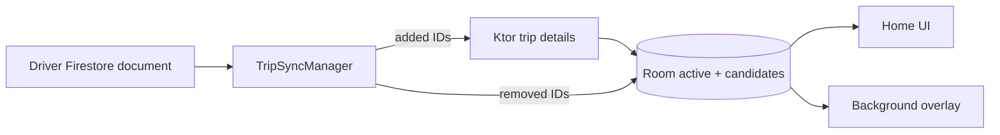

## Verification Scope

The captain app does not use a WebSocket for dispatch or location. Firestore streams assignment state; Ktor HTTP fetches trip payloads and uploads location. The service does not use `START_STICKY`, a WakeLock, sub-second updates, or adaptive location intervals.

## Online Mode Owns the Service Lifecycle

`DriverServiceController` observes `DriverAvailability`. When availability is `ONLINE` and either coarse or fine location permission exists, it starts `DriverForegroundService`. Going offline or logging out stops it.

The service is a `LifecycleService` registered as `location|specialUse`. `onCreate()` immediately publishes its notification, then starts four concurrent responsibilities:

1. Observe Firestore trip assignment.
2. Observe availability and stop when it becomes offline.
3. Collect fused location and upload it.
4. Control background overlays from trip, availability, and app foreground state.

This aligns persistent system cost with a user-visible mode: the driver explicitly being online.

## Firestore Is the Assignment Signal

`DriverRemoteDataSource` watches `Drivers/{driverId}`. It maps document fields into `DriverTripState`:

- `tripId` and `status` identify one active trip.
- `tripIds` identifies candidate requests.
- `isAvailable` controls driver availability.

The listener does not carry the full trip payload. That is the responsibility of Ktor and the local database.

## TripSyncManager Reconciles Room

`TripSyncManager` compares the new Firestore state with its in-memory candidate set.

- New candidate ID: fetch the trip over Ktor, serialize its DTO, and upsert `CandidateTripEntity`.
- Removed candidate ID: delete it from Room.
- Active trip ID: clear candidates, fetch the active trip, replace the single active row.
- No active trip: clear the active row.

Room is the observable read model for both the foreground UI and the system overlay. Firestore invalidates; Ktor hydrates; Room renders.

## Location Upload Is Bounded by Time and Distance

`LocationRepositoryImpl` creates a high-accuracy request with a 10-second target interval and 100-meter minimum displacement. The callback enters a `callbackFlow` and is removed in `awaitClose`.

The service collects with `collectLatest` and calls `UpdateDriverLocationUseCase`. `DriverRemoteDataSource.updateDriverLocation()` posts latitude, longitude, location-permission status, notification permission, version name, and FCM token to the `update-location` HTTP endpoint.

This favors battery control over map animation frequency. It is not a continuous socket stream.

## Compose Outside the Activity

When the app is backgrounded and overlay permission exists, `OverlayManager` adds a `ComposeView` to `WindowManager`:

- A pending trip shows a modal `IncomingTripOverlay`.
- An online driver with no pending trip sees a draggable floating launcher.
- Foreground app state, offline state, or missing permission hides the overlay.

The manager supplies lifecycle, saved-state, and ViewModel-store owners before setting Compose content. This prevents the common failure mode where Compose is attached to a system window without lifecycle infrastructure.

## Recovery: What Exists and What Does Not

Room survives process death, and both Splash and Home start `DriverServiceController`, so reopening the app can re-observe Firestore and repair the cache.

The current implementation does not provide autonomous recovery in every case:

- No boot receiver starts the service after reboot.
- The service does not return `START_STICKY`.
- Firestore collection errors are logged without `retryWhen`.
- Location flow errors are caught and logged, after which that collection ends.
- `serviceStarted` is an in-memory boolean, not a query of Android service state.

These are concrete next reliability steps. Presenting them makes the architecture more useful than claiming a recovery loop that is not in the code.

