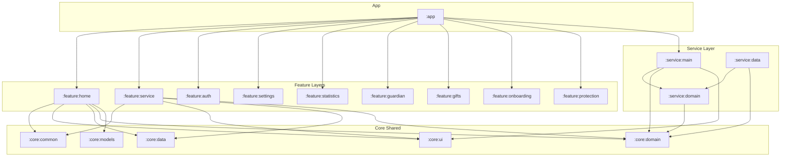
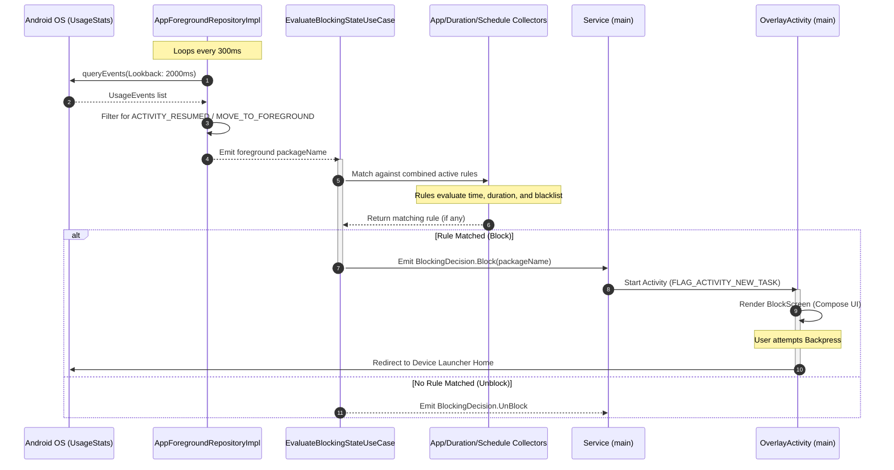
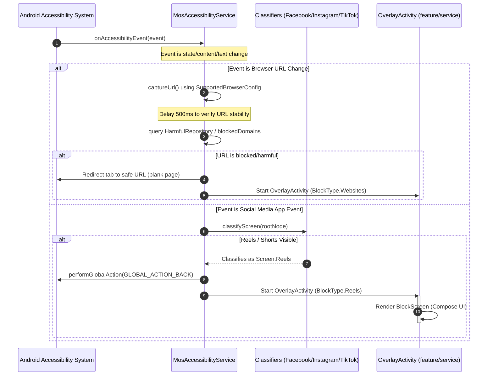
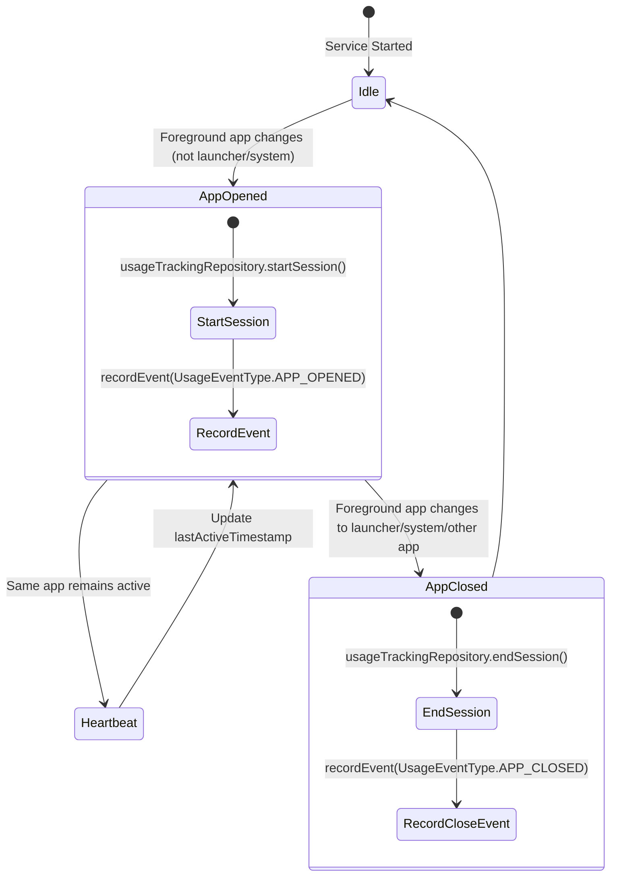

# Verified Technical Model - Mostaqeem Android Project

This document provides a verified architectural model of the Mostaqeem Android project, reverse-engineered from the codebase located at `D:\Projects\Clients\Mostaqeem`. Every detail has been cross-referenced with the source code.

---

## 1. Module Structure and Dependencies

The project uses Kotlin DSL (`build.gradle.kts` and `settings.gradle.kts`) and is structured into multiple core, feature, and service modules:

### Included Modules (`settings.gradle.kts`)
*   **App Module**: `:app`
*   **Core Modules**:
    *   `:core:common`: Utility extension functions, permission utilities, and constants.
    *   `:core:domain`: Main domain entities and UseCases (auth, apps, domains, schedules, analytics).
    *   `:core:data`: Main data repositories, local Room database, migrations, and remote source integrations.
    *   `:core:models`: Hilt model classes (e.g., `ProtectionAction`).
    *   `:core:ui`: Common Compose UI theme elements, common layouts, and the shared `BlockScreen`.
*   **Feature Modules**:
    *   `:feature:home`: Core user features (App Blocking, reels, schedule, limits screens, and view models).
    *   `:feature:guardian`: Guardian protection controls.
    *   `:feature:gifts`: Reward system screen.
    *   `:feature:statistics`: Digital Wellbeing dashboard showing aggregates.
    *   `:feature:settings`: General application configurations.
    *   `:feature:onboarding`: User onboarding walkthrough.
    *   `:feature:auth`: Signup, login, OTP authentication flows.
    *   `:feature:protection`: Protection layer verification dialogs/activities.
    *   `:feature:service`: Accessibility-based fine-grained URL and Reels blocker.
*   **Service Modules**:
    *   `:service:main`: Main polling-based foreground service, workers, overlay launcher, and session tracking.
    *   `:service:domain`: Interfaces and models for rule evaluation, foreground repositories, and use cases.
    *   `:service:data`: Implemented collectors (duration, schedule, app list) and repositories.
*   **Shared Modules**:
    *   `:shared:test`: Testing utilities.

---

## 2. Layer Boundaries (Clean Architecture)

The codebase strictly segregates responsibilities across clean boundaries, utilizing Hilt for dependency injection:

### UI / Presentation Layer
*   **Location**: Inside individual `:feature` subdirectories (e.g. `feature/home/src/main/java/com/mostaqeem/feature/home/apps`).
*   **Components**: Jetpack Compose Screens (e.g., `AppsScreen.kt`) and Jetpack Lifecycle ViewModels (e.g., `AppsViewModel.kt`). Communication is event-driven via Kotlin StateFlows (`AppsUiState`) and events (`AppsUiEvent`).

### Domain Layer
*   **Location**: `core/domain` and `service/domain`.
*   **Components**: Plain Kotlin structures without Android framework dependencies. Contains repository interfaces (e.g., `AppsRepository`, `AppForegroundRepository`), data models (e.g., `EvaluationContext`, `BlockingDecision`), and UseCases (e.g., `EvaluateBlockingStateUseCase`).

### Data Layer
*   **Location**: `core/data` and `service/data`.
*   **Components**: Implementation of repository interfaces, local databases (`MosDatabase` via Room version 3), Room DAOs (e.g., `AppsDao`), migrations (`MIGRATION_2_3`), and network services.

---

## 3. Foreground Service and System Configurations

The background architecture is composed of two independent engines to bypass system constraints and execute persistent monitoring.

### Engine A: Polling Foreground Service (`:service:main`)
*   **Class Name**: `com.mostaqeem.service.main.Service` (extends `LifecycleService`).
*   **Lifecycle**: Started as a foreground service using `ContextCompat.startForegroundService` and `ServiceStarter.startService`.
*   **Foreground Registration**: Registered in `service/main/src/main/AndroidManifest.xml` with `android:foregroundServiceType="specialUse"` and property sub-type `Using Usage Stats...`. It calls `startForeground()` inside `onStartCommand` using notifications created by `ServiceNotificationManager`.
*   **Polling Loop**: Polling is executed by `AppForegroundRepositoryImpl` inside an infinite `while(true)` loop running on `Dispatchers.IO` with a `POLL_INTERVAL_MS` of **300ms**.
*   **System Permissions**: Assured by `PermissionChecker` checking for `android.permission.PACKAGE_USAGE_STATS` (UsageStatsManager) and `android.permission.SYSTEM_ALERT_WINDOW` (Overlay).
*   **Session Tracking System**: Managed by `SessionTrackingManager`. It listens to the foreground package flow, records session starts/stops in the local DB (`usageTrackingRepository`), and filters out launcher apps and system packages via a hardcoded blacklist `isLauncherOrSystemApp(packageName)`.

### Engine B: Accessibility Service (`:feature:service`)
*   **Class Name**: `com.mostaqeem.feature.service.MosAccessibilityService` (extends `AccessibilityService`).
*   **Registration**: Registered in `feature/service/src/main/AndroidManifest.xml` requiring `android.permission.BIND_ACCESSIBILITY_SERVICE` and configuration metadata `@xml/accessibilityservice`.
*   **Event Handling**: Handles `AccessibilityEvent.TYPE_WINDOW_CONTENT_CHANGED`, `TYPE_WINDOW_STATE_CHANGED`, and `TYPE_VIEW_TEXT_CHANGED` by invoking `resolveWindowStateChangeEvent(event)` inside the injected CoroutineScope.
*   **Browser Interception**: Reads omnibar text views dynamically via browser configurations (`SupportedBrowserConfig`). Supports 14+ browsers (Chrome, Firefox, DuckDuckGo, Brave, etc.) mapping their package names to their address bar IDs (e.g., `com.android.chrome:id/url_bar`). If the normalized domain belongs to `blockedDomains` or is marked as harmful in `HarmfulRepository`, it redirects the tab to `Constants.DEFAULT_BROWSER_SAFE_URL` (blank page) and launches `OverlayActivity`.
*   **Social Media Classifiers**:
    *   `FacebookChecker`: Checks for ViewPager classes, Reels tabs, and text fields in Arabic/English to isolate Reels and Videos while bypassing Stories.
    *   `InstagramChecker`: Checks for `$PKG:id/clips_video_container` and reels viewer layouts. Mutes the system volume stream (`STREAM_MUSIC`) if the user is on the main Home Feed to block sound on autoplays.
    *   `TikTokChecker`: Inspects obfuscated nodes for "aweme" IDs and vertical viewpagers.
    *   `checkYoutubeContent`: Detects Youtube Shorts by checking for `reel_recycler` view IDs.
*   **Leaving Blocked Content**: Triggers a global back action (`GLOBAL_ACTION_BACK`) to pop out of Reels layouts.

### Background Execution & Battery Settings
*   **Worker Keep-Alive**: `ServiceCheckerWorker` executes a periodic work request every **16 minutes** (`WorkerStarter.startServiceCheckerWorker`) to ensure the foreground service is restarted if killed by the OS.
*   **Boot Recovery**: `BootCompletedReceiver` launches the foreground service and registers the WorkManager keep-alive worker immediately on `ACTION_BOOT_COMPLETED`.
*   **Doze Mode Bypass**: `PermissionsBottomSheet` prompts the user to grant `Settings.ACTION_REQUEST_IGNORE_BATTERY_OPTIMIZATIONS` for the app to ignore system battery saver throttling.

---

## 4. App Blocking Engine Flow

The blocking execution flows sequentially through the Clean Architecture boundaries:

### Flow 1: Foreground Service Polling (Main App Blocker)

### Flow 2: Accessibility Interception (Reels & URL Blocker)

### Flow 3: Session Tracking State Machine

---

## 5. Technical Debt and Trade-offs

During analysis, several technical trade-offs, security implications, and design boundaries were identified:

1.  **UsageStatsManager Polling vs. Event-Driven Performance**: 
    *   *Trade-off*: Polling the foreground package name every 300ms consumes continuous CPU cycles and battery.
    *   *Alternative*: While the accessibility service is event-driven, it relies on complex accessibility tree traversals that can also cause UI stutters.
2.  **Duplicated Overlay Activities**:
    *   *Trade-off*: The app contains two separate implementations of `OverlayActivity` (one in `:service:main` and one in `:feature:service`), loading different layouts but sharing dismissal behavior. This introduces redundancy.
3.  **Fragility of View ID Scans**:
    *   *Trade-off*: Social media checkers search for hardcoded view IDs (e.g., `clips_video_container` for Instagram, `reel_recycler` for YouTube). If these platforms update their obfuscated resource names, the blocking engine will fail silently until an app update is released.
4.  **Security Bypass in Overlay Dismissal**:
    *   *Trade-off*: The overlay intercepts back presses, but it delegates closing by posting a delayed runnable (`Handler.postDelayed`) checking `isFinishing`. A fast user interaction or custom task-manager swipe can occasionally terminate the overlay task, rendering the blocked app visible.
