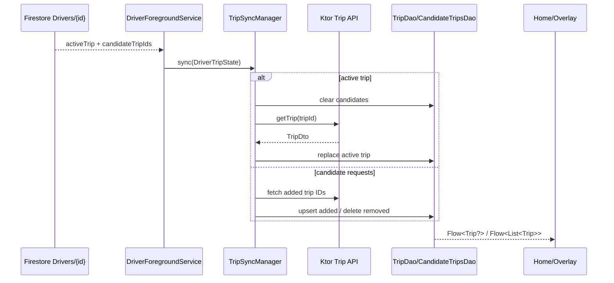

# Verified Technical Model - National Taxi Captain

Source: `D:\Projects\National-Taxi-Captain`

Confidence: **Verified** unless a section explicitly says otherwise.

## 1. Module and Build Structure

The driver app has three modules:

- `:app`: Compose UI, foreground service, overlays, ViewModels, FCM, and MapLibre rendering.
- `:domain`: entities, repository contracts, and use cases.
- `:data`: Ktor, Firestore, DataStore, Room, fused location, and repository implementations.

Koin is the composition mechanism. Ktor/OkHttp calls the Taxi Alwatani API. Firestore streams driver assignment and availability. Room version 2 stores one active trip plus a set of candidate trips.

## 2. Foreground Execution

`DriverServiceController` observes driver availability. When it becomes `ONLINE` and coarse or fine location permission exists, it starts `DriverForegroundService` with `ContextCompat.startForegroundService()`; it stops the service when availability becomes `OFFLINE` or logout is emitted.

`DriverForegroundService` extends `LifecycleService`, immediately calls `startForeground()`, then starts four pipelines:

1. Observe Firestore driver assignment and synchronize trip caches.
2. Observe availability and stop when offline.
3. Collect fused location and upload it through `update-location`.
4. Combine active trip, availability, and app foreground state to control overlays.

The manifest registers `foregroundServiceType="location|specialUse"` with a declared special-use subtype.

## 3. Dispatch and Cache Synchronization

`DriverRemoteDataSource.observeAssignedTripId()` observes `Drivers/{driverId}` in Firestore. The document supplies:

- `tripId` and `status` for an active trip.
- `tripIds` for candidate requests.
- `isAvailable` for driver availability.

`TripSyncManager` reconciles the Firestore set with Room:

- Active trip: clears candidate rows, fetches the active trip over Ktor, clears the prior active row, and saves the new row.
- Candidate trips: computes added and removed IDs, fetches newly added trips, and removes stale rows.
- No active trip: clears the active row.

The UI and overlay layer observe Room through `ObserveActiveTripUseCase` and `ObserveCandidateTripsUseCase`. This makes Room the local read model while Firestore acts as the assignment signal and Ktor supplies full trip payloads.

## 4. Location Pipeline

`LocationRepositoryImpl` requests high-accuracy fused location updates with:

- Desired interval: 10 seconds.
- Minimum displacement: 100 meters.
- `setWaitForAccurateLocation(false)`.

The callback is wrapped in `callbackFlow` and removed in `awaitClose`. The service uses `collectLatest` and calls `UpdateDriverLocationUseCase`, which posts latitude, longitude, permission status, notification permission, version name, and FCM token to `update-location`.

This is HTTP upload, not a WebSocket stream.

## 5. Background Overlays

When the app is backgrounded and overlay permission is granted:

- A pending trip displays `IncomingTripOverlay` as a modal system window.
- An online driver with no pending trip receives a draggable floating launcher.
- Returning to the foreground, losing permission, or going offline hides the overlay.

`OverlayManager` installs lifecycle, saved-state, and ViewModel-store owners on the `ComposeView`, preventing Compose content from running without a lifecycle owner.

## 6. Recovery Boundary

Verified recovery:

- Room persists active and candidate trip payloads across process death.
- Splash and Home call `DriverServiceController.start()`, which re-observes Firestore availability and can restart the service after the app is launched.
- Firestore assignment reconciliation repairs the Room cache after collection resumes.

Not verified:

- No boot receiver restarts the service after device reboot.
- `DriverForegroundService` does not override `onStartCommand()` to return `START_STICKY`.
- Firestore and location collection errors are caught and logged without `retryWhen`; a failed collection does not automatically resubscribe inside the same service instance.

## 7. Network and Persistence

The Ktor client has 30-second request/connect/socket timeouts, bearer authentication, language headers, and forced logout on 401. Room is configured with `fallbackToDestructiveMigration(true)`.

## 8. Verified Constraints and Debt

1. A Firestore listener error terminates assignment or availability collection without an explicit retry loop.
2. Location collection errors are swallowed after logging, so uploads stop until the service restarts.
3. `DriverServiceController.serviceStarted` is process-local and cannot prove whether Android already has a service instance.
4. No boot recovery or sticky restart exists.
5. Destructive migration can erase active/candidate trip caches.
6. Release builds use the debug signing configuration.
7. The manifest includes invalid or nonstandard permission names such as `SYSTEM_OVERLAY_WINDOW` and `ACTION_MANAGE_OVERLAY_PERMISSION`; `SYSTEM_ALERT_WINDOW` is the operative overlay permission.

## 9. Accuracy Corrections for the Existing Portfolio Draft

- Dispatch uses Firestore listeners plus Ktor HTTP, not a bidirectional WebSocket.
- Location updates target 10 seconds or 100 meters, not sub-second, 1-second, 2-second, or 5-meter intervals.
- No WakeLock is acquired.
- No adaptive interval by trip status is implemented.
- No `START_STICKY` restart path is present.

