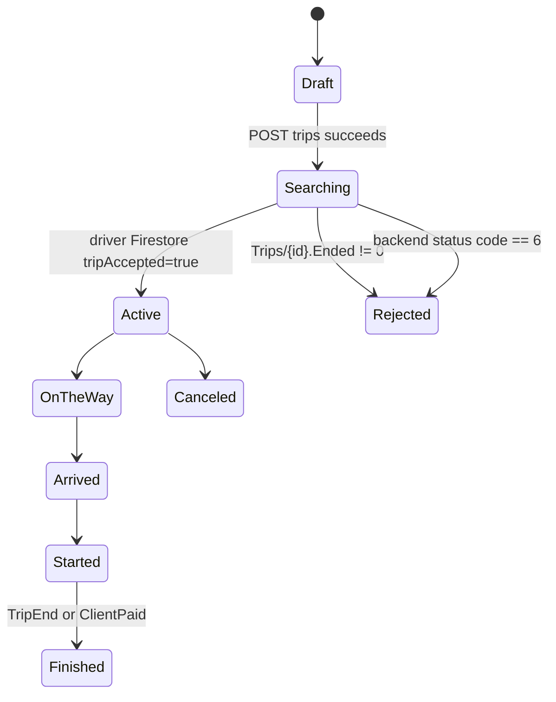

# Verified Technical Model - NationalTaxi Client

Source: `D:\Projects\NationalTaxi\NationalTaxi`

Confidence: **Verified** unless a section explicitly says otherwise.

## 1. Module and Build Structure

The client app has three modules:

- `:app`: Compose UI, navigation, ViewModels, FCM integration, and the application composition root.
- `:domain`: entities, repository contracts, use cases, and Flow/Result abstractions.
- `:data`: Ktor networking, Firestore listeners, DataStore, Paging sources, Room declarations, and repository implementations.

Koin provides dependency injection. Ktor with OkHttp calls `https://dash.taxialwatani.com/api/`. Firestore carries dispatch and driver state. Room version 1 declares an `active_trip` table.

## 2. Trip Creation State Machine

`TripFlowViewModel` owns pickup, destination, category, and searching steps. `TripFlowStatePersister` stores `PersistedTripState` in `SavedStateHandle`, which recovers UI state across configuration changes and ordinary process recreation when Navigation restores the handle.

`CreateTripUseCase` validates the complete request, calls `TripRepository.createTrip()`, emits `TripCreated`, then delegates search resolution to `ObserveTripSearchUseCase`.

The search use case races three flows and accepts the first terminal result:

1. Firestore `Drivers` query where `tripId` matches, emitting acceptance when `tripAccepted == true`.
2. Firestore `Trips/{tripId}` document, emitting rejection when `Ended` changes from zero.
3. `current-trip-status` HTTP polling every 30 seconds, emitting rejection when the backend returns code 6.

## 3. Active Trip Realtime Flow

`GetTripDetailsAndObserveStatusUseCase` first fetches authoritative trip details over Ktor. If a driver exists, it observes that driver's Firestore document through `TripRepositoryImpl.observeTripDetails()`.

The Firestore DTO is mapped to:

- `TripStatus`: Pending, OnTheWay, Arrived, Started, ClientPaid, TripEnd, Canceled, or Failed.
- Current driver latitude/longitude.

`ActiveTripViewModel` reduces each status into markers, camera targets, routes, cancellation availability, and terminal navigation. Route recomputation is status-aware: driver-to-pickup while OnTheWay, and driver-to-destination after Started.

## 4. Location and Mapping

`LocationRepositoryImpl` wraps `FusedLocationProviderClient` in `callbackFlow`, requests high-accuracy updates every 10 seconds, and removes the callback in `awaitClose`. Missing permissions and disabled location services throw explicit domain exceptions. Reverse geocoding runs on `Dispatchers.IO`.

## 5. Local Persistence Boundary

Room contains `ActiveTripEntity` and `ActiveTripDao`, and Koin constructs the database with `fallbackToDestructiveMigration(true)`. However, no production class injects or calls `ActiveTripDao`; only the database declarations and module bindings reference it.

Therefore the current booking flow is **not verified as Room-backed or offline recoverable**. Its active recovery mechanisms are backend `hasActiveTrip()`, Firestore, and `SavedStateHandle` UI persistence.

## 6. Network and Authentication

The Ktor client installs JSON, bearer auth, request logging, and default language headers. It sets `expectSuccess = false`, and an HTTP 401 clears the stored token and emits a forced-logout signal. Refresh tokens are not used.

## 7. Verified Constraints and Debt

1. `TripRepositoryImpl` contains two overloaded `createTrip()` methods that throw `TODO("Not yet implemented")`; the currently used full route overload is implemented.
2. When Firestore omits driver coordinates, `observeTripDetails()` substitutes `Location(31.5, 32.65)`, which can display a false location.
3. The Room active-trip cache is wired into Koin but unused by the trip flow.
4. Both app and data modules use release settings that require scrutiny: the app release build signs with the debug signing config.
5. The manifest requests background and foreground-service permissions, but no client foreground service is registered.
6. Destructive Room migration can discard any future active-trip rows.

## 8. Accuracy Corrections for the Existing Portfolio Draft

- Firestore snapshot listeners, not WebSockets, drive trip acceptance and active driver status.
- The client is already split into app/domain/data modules; claims about a verified multi-month refactor timeline or parallel legacy implementation cannot be derived from this repository.
- Room is present but does not currently provide active-trip recovery.

