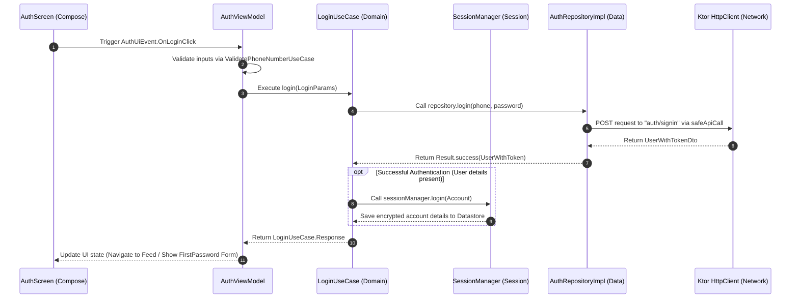
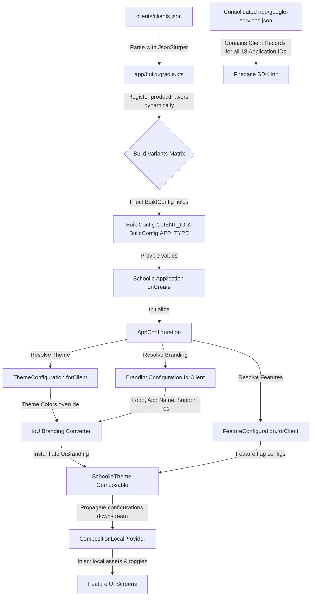
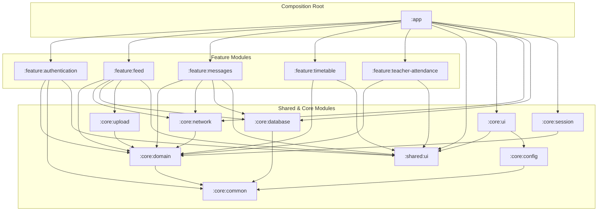

# Schoolie Android Project — Verified Technical Model

This document provides a verified technical model of the Schoolie Android codebase located at `D:\Projects\SAGA\Schoolie`. All details and code traces in this report have been directly extracted and verified against the implementation files of the project.

---

## 1. Module Structure and Configuration

The Schoolie project is structured as a multi-module, highly decoupled Android application utilizing a composite build setup (`build-logic`) for shared build configurations.

### 1.1 Root Configuration
- **Gradle Properties (`gradle.properties`)**: Configure performance and compilation optimization flags:
  - Parallel compilation: `org.gradle.parallel=true`
  - Build caching: `org.gradle.caching=true`
  - Configure on demand: `org.gradle.configureondemand=true`
  - Configuration cache: `org.gradle.configuration-cache=true`
  - Configuration cache parallel execution: `org.gradle.configuration-cache.parallel=true`
  - File system watching: `org.gradle.vfs.watch=true`
  - JVM arguments: `org.gradle.jvmargs=-Xmx10G -Dfile.encoding=UTF-8`
- **Dependency Catalog (`gradle/libs.versions.toml`)**: Centralizes all dependencies, versions, bundles, and plugins (e.g., Ktor `3.4.0`, Room `2.8.4`, Koin `4.2.0-RC1`, Kotlin `2.3.20`, AGP `9.2.1`).

### 1.2 Subprojects (Modules)
The application includes the following modules:
- **`:app`**: The application assembler/composition root. Contains launcher settings, dynamic product flavor generation, application lifecycle, and main Koin dependency injection configuration.
- **`:language`**: A module dedicated to localized language management (using `LanguageManager`, `PreferenceLocaleStore`, etc.).
- **`:shared:ui`**: Common reusable Jetpack Compose components, custom styles, custom layouts, and themes (e.g., `AppPrimaryButton`, `UploadProgressDialog`, `SchoolieTheme`).
- **`core:` Modules (Cross-cutting infrastructure)**:
  - `:core:common`: Core utility classes (like `AppType` enum).
  - `:core:config`: Static configurations, theme configurations, features list, and branding overrides.
  - `:core:theme`: Shared branding configurations.
  - `:core:network`: Ktor client configuration, connectivity managers, error mappings.
  - `:core:database`: Room Database class (`AppDatabase`), entity declarations, and DAOs.
  - `:core:session`: Session management, account credentials storage, encryption helper, and onboarding state.
  - `:core:ui`: Navigational foundation (`SchoolieNavHost`), app bar settings, splash screen layout.
  - `:core:datetime`: Date and time formatters/converters.
  - `:core:upload:domain` and `:core:upload:data`: File/media upload executors and databases.
- **`feature:` Modules (Business boundaries)**:
  Partitioned into **domain**, **data**, and **presentation** submodules for separation of concerns:
  - `:feature:authentication` (data, domain, presentation)
  - `:feature:feed` (data, domain, presentation)
  - `:feature:gallery` (data, domain, presentation)
  - `:feature:profile` (data, domain, presentation)
  - `:feature:timetable` (data, domain, presentation)
  - `:feature:daily-report` (data, domain, presentation)
  - `:feature:assignments` (data, domain, presentation)
  - `:feature:question-bank` (data, domain, presentation)
  - `:feature:teacher-attendance` (data, domain, presentation)
  - `:feature:behaviour` (data, domain, presentation)
  - `:feature:monthly-report` (data, domain, presentation)
  - `:feature:grades` (data, domain, presentation)
  - `:feature:absence` (data, domain, presentation)
  - `:feature:student-progress` (data, domain, presentation)
  - `:feature:meetings` (data, domain, presentation)
  - `:feature:messages` (data, domain, presentation)
  - `:feature:menu:presentation`
  - `:feature:teacher:data`
  - `:feature:parent:data`

---

## 2. Dynamic Product Flavors & White-Label Architecture

Schoolie is a white-label application supporting multiple brands (18 verified clients) through dynamic Gradle configurations, runtime configuration mappings, and a single consolidated Firebase descriptor.

### 2.1 Dynamic Flavor Generation (`app/build.gradle.kts`)
Rather than hardcoding product flavors in Gradle, the project reads a central configuration file `clients/clients.json` during the Gradle configuration phase:
```kotlin
val clientsJsonFile = rootProject.file("clients/clients.json")
val clients = run {
    val parsed = JsonSlurper().parse(clientsJsonFile)
    return@run if (parsed is List<*>) parsed.filterIsInstance<Map<String, Any>>() else emptyList()
}
```
Flavors are registered dynamically:
```kotlin
flavorDimensions += "client"
productFlavors {
    clients.forEach { client ->
        val id = client["id"] as String
        register(id) {
            dimension = "client"
            applicationIdSuffix = client["applicationIdSuffix"] as String
            versionCode = (client["versionCode"] as Int)
            versionName = client["versionName"] as String

            buildConfigField("String", "CLIENT_ID", "\"$id\"")
            buildConfigField("String", "APP_TYPE", "\"${client["type"]}\"")
        }
    }
}
```
This enables white-label variant generation at compile time.

### 2.2 Branding & Feature Flags Resolution (`core:config`)
At runtime, within `Schoolie.kt` (the `Application` class), the app initializes configuration details using values supplied by the generated `BuildConfig` fields:
```kotlin
AppConfiguration.initialize(
    clientId = BuildConfig.CLIENT_ID,
    packageName = BuildConfig.APPLICATION_ID,
    appTypeString = BuildConfig.APP_TYPE
)
```
The dynamic configs are distributed into three core models:
1. **`FeatureConfiguration`**: Determines enabled features by `AppType` (e.g., `SCHOOL` has `advancedGrading` and `examCreation` enabled; `PRESCHOOL` has `napTimeTracking`, `diaperTracking`, and `mealTracking` enabled). It also supports overrides for specific `clientId` values.
2. **`ThemeConfiguration`**: Resolves brand-specific Light/Dark color palettes. For instance, the `"grow"` brand overrides default primary/secondary colors with `Color.Cyan` / `Color.Blue` for light palette.
3. **`BrandingConfiguration`**: Configures app names (`appName` string resource), icons (`icon`), logos (`logo`), support details (phone and email), and about descriptions.

### 2.3 Single-File Firebase Configuration (`google-services.json`)
Rather than maintaining separate directories or copying files dynamically for each product flavor, the app stores a single consolidated `app/google-services.json`. This file includes a client record for each of the 18 application IDs (e.g. `com.saga.grow`, `com.saga.change_academy`, etc.) pointing to the same Firebase project (`school-ba8cb`).

---

## 3. UI Layer & Compose Migration Status

### 3.1 100% Jetpack Compose Architecture
The UI of Schoolie is built entirely in **Jetpack Compose**.
- **No XML Layout Files**: A full search of the repository reveals that there are zero XML layout files located in any of the subprojects' `/src/main/res/layout` folders. XML is exclusively used for standard resource declarations (drawables, mipmaps, values, manifests, configurations).
- **Compose Navigation**: Navigation is fully managed via type-safe Jetpack Compose Navigation routes (e.g., `GraphDestination`, `AuthDestination`, `GalleryDestination`).
- **Main Entry Point**: `MainActivity` inherits from `ComponentActivity` and calls `setContent` to launch the root Compose content:
  ```kotlin
  setContent {
      Language {
          Schoolie()
      }
  }
  ```

### 3.2 Dynamic Context-Driven Theme Propagation
Within `Schoolie.kt` (Compose UI entry point), branding configurations are resolved:
```kotlin
val branding = remember { AppConfiguration.branding.toUiBranding(AppConfiguration.theme) }
val featureConfiguration = remember { AppConfiguration.features }
```
These are passed to `SchoolieTheme`, which instantiates Compose `CompositionLocalProvider` wrappers for downstream theme access:
```kotlin
CompositionLocalProvider(
    LocalBranding provides branding, 
    LocalFeatureConfiguration provides featureConfiguration
) {
    MaterialTheme(colorScheme = colorScheme, typography = Typography, content = content)
}
```

---

## 4. Core Architecture Patterns

### 4.1 Dependency Injection (Koin)
- **Compile-Time Scanning**: Koin annotation processing compiles dependencies using annotations like `@Single`, `@KoinViewModel`, and `@KoinWorker`.
- **Composition Root**: In `Schoolie.kt`, Koin is initialized pointing to the main `AppModule`:
  ```kotlin
  startKoin<Schoolie> {
      androidLogger()
      androidContext(this@Schoolie)
      workManagerFactory() // Enables WorkManager dependency injection
  }
  ```
  `AppModule.kt` is annotated with `@Module` and lists all scanned subproject modules using the `includes` array (e.g. `NetworkModule::class`, `LocalDataModule::class`, and feature modules).

### 4.2 Networking (Ktor)
- **HttpClient Setup**: Configured in `NetworkModule.kt` using Ktor's `Android` engine.
- **Bearer Authentication**: Bearer auth plugin automatically grabs the access token from the Koin-provided `SessionManager.sessionState` flow and appends it to requests. Public endpoints (`auth/signin`, `auth/create-first-password`) are explicitly excluded.
- **Dynamic Context Injection**: The `defaultRequest` plugin automatically appends active context parameters depending on the user's role, avoiding manual ID forwarding across the domain layers:
  - For `UserContext.Parent`: Appends `studentId` and `classId` automatically to the query parameters of every outgoing API call.
  - For `UserContext.Teacher`: Appends `subjectId` automatically to query parameters.
- **Layer Boundary Error Mapping**: To prevent Ktor leakage into domain layers, repositories call remote services using `safeApiCall {}` (defined in `:core:network`). This wraps requests in a `try-catch` block, maps errors via `toDataException()`, and then translates them into clean business exceptions via `toDomainException()`:
  ```kotlin
  suspend fun <T> safeApiCall(apiCall: suspend () -> T): Result<T> {
      return try {
          Result.success(apiCall())
      } catch (throwable: Throwable) {
          Result.failure(throwable.toDataException().toDomainException())
      }
  }
  ```

### 4.3 Persistence (Room)
- **Database Class**: `AppDatabase.kt` defines a Room database named `schoolie-database` (version 12).
- **Type Converters**: Custom converters are registered for custom database field structures, e.g. `ClassIdConverter` and `StringListConverter`.
- **Entities Managed**: 13 database entities including `SubjectEntity`, `StudentEntity`, `UploadEntity`, `FeedPostEntity`, `PostQueueEntity`, and `ConversationEntity`.

### 4.4 Background Synchronization (WorkManager)
The project utilizes WorkManager with on-demand initialization. Three custom background workers are declared and annotated with `@KoinWorker` to support constructor injection:
1. **`UploadWorker`** (in `:core:upload:data`): Processes media uploads. Calls `UploadNotificationManager` to create a foreground notification displaying progress.
2. **`PostQueueWorker`** (in `:feature:feed:data`): Processes the queue of posts written offline to be sent to the server. Updates a foreground notification with creation progress.
3. **`ReactionSyncWorker`** (in `:feature:feed:data`): Synchronizes offline feed reactions (likes/comments) back to the remote server.

### 4.5 Location Tracking (Fused Location Provider)
- **Class**: `FusedLocationTracker` (registered as `LocationTracker` inside `:feature:teacher-attendance:data`).
- **Implementation**: Wraps GMS `FusedLocationProviderClient` within a Kotlin Coroutine `callbackFlow`:
  - Enforces `Manifest.permission.ACCESS_FINE_LOCATION` checks.
  - Configures `LocationRequest` with `PRIORITY_HIGH_ACCURACY`, setting updates to trigger every 1s (interval: `1000L`, max wait time: `500L`).
  - Cleans up and removes location updates inside the `awaitClose` block when the subscriber cancels the flow.

---

## 5. Technical Debt and Architectural Observations

1. **Dark Theme Hardcoded to False**:
   Inside `Theme.kt` (`SchoolieTheme`), dark mode is disabled via a hardcoded boolean:
   ```kotlin
   val darkTheme = false
   ```
   This prevents the app from displaying dark theme mode, rendering the dark theme configurations in `ThemeConfiguration.kt` unused.
2. **Destructive Database Migrations**:
   The Room database builder inside `LocalDataModule.kt` is configured with:
   ```kotlin
   .fallbackToDestructiveMigration(true)
   ```
   Since the app caches feed posts, messages, and offline queues locally, a destructive migration on schema changes will wipe out all user data and local queues.
3. **Commented-Out Security Actions**:
   In `NetworkModule.kt`, the authentication token refresh block (`refreshTokens { ... }`) is commented out. If the user session token expires, requests will fail instead of executing a refresh handshake.
4. **TODO Comments on Business Logic**:
   Several crucial logic checkpoints contain TODO markers:
   - In `FeatureConfiguration.kt`: `// TODO: Configure Clients` (line 57).
   - In `EncryptedSessionStorage.kt`: `// TODO: verify this user actually exists before switching` (line 82) which bypasses sanity verification when switching user accounts in multi-tenant mode.
5. **No Repository-Level CI/CD Pipelines**:
   The codebase contains no CI/CD pipeline configurations (e.g. GitHub actions workflows or gitlab-ci YAMLs). Build automation, testing, and variant signing depend entirely on local system configurations.

---

## 6. Technical Architecture Diagrams

### 6.1 Clean Architecture Boundary Flow (Login Operation Example)



---

### 6.2 White-Label Configuration & Asset Distribution Flow



---

### 6.3 Core Module Dependency Graph


