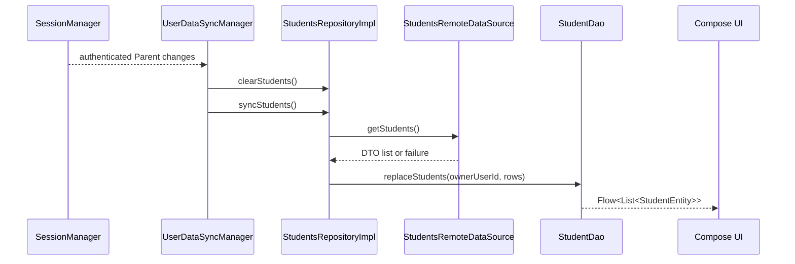

# Verified Technical Model - StudentWayParent

Source: `D:\Projects\StudentWayParent`

Confidence: **Verified** unless a section explicitly says otherwise.

## 1. Module and Build Structure

`settings.gradle.kts` declares 45 modules. The app is assembled from `:app`, six core modules, `:language`, and twelve feature areas split into `data`, `domain`, and `presentation` modules:

- Core: `:core:common`, `:core:database`, `:core:domain`, `:core:network`, `:core:notifications`, `:core:session`, and `:core:ui`.
- Features: auth, wallet, home, students, transportation, live tracking, settings, notifications, timeline, absence, schedule, and messages.
- Build logic: an included `build-logic` build supplies Android, Koin, and feature-layer convention plugins.

The application is Jetpack Compose based. Koin annotations and KSP provide dependency injection; Ktor is the HTTP client; Room is local persistence; Paging 3 handles paginated data; Firebase Realtime Database supplies vehicle location updates; Pusher supplies chat events.

## 2. Layer Boundaries

- Presentation modules contain Compose screens and `@KoinViewModel` classes.
- Domain modules contain models, repository interfaces, and use cases.
- Data modules contain repository implementations, Ktor sources, Room entities/DAOs, Paging sources, and realtime adapters.
- `:app` is the composition root and depends on all feature layers.

The feature boundaries are real Gradle boundaries, not folders inside one module.

## 3. Shared Student Cache

`StudentsRepositoryImpl` is session aware. `observeStudents()` switches its Room query whenever `SessionManager.sessionState` changes and emits an empty list when there is no authenticated parent.

`refreshStudents()`:

1. Resolves the active `Parent` from `SessionManager`.
2. Calls `StudentsRemoteDataSource.getStudents()`.
3. Replaces the rows owned by that parent in `StudentDao`.
4. Leaves the previous cache intact when the remote call fails.

`StudentDao` scopes rows by `ownerUserId`, orders them by name, and uses `OnConflictStrategy.REPLACE`. `UserDataSyncManager`, created eagerly by Koin, observes account changes, clears the prior student cache, and launches profile, wallet, student, and home-location syncs for authenticated parents.

## 4. Room and Offline Read Paths

`AppDatabase` is version 6 and contains wallet, student, home-location, conversation, message, and message-page-state entities. `LocalDataModule` builds `student-way-database` with `fallbackToDestructiveMigration(true)`.

The strongest offline-first implementation is messaging:

- `MessagesRepositoryImpl.observeMessages()` exposes Room as a Paging source.
- `MessagesRemoteMediator` loads remote pages and persists them before Paging emits them.
- A refresh replaces synchronized server messages while preserving local pending messages through the local data source contract.
- Outgoing text messages are inserted immediately with a `local-{UUID}` ID and `PENDING` delivery state.
- A successful response replaces the optimistic row with the server row.
- A failure changes the optimistic row to `FAILED` and records the reason.
- Realtime Pusher events are cached into Room before being mapped to domain events.

This is verified offline-readable and optimistic, but not a general durable offline-write queue: no worker retries failed messages in the current code.

## 5. Live Trip Tracking

`TripTrackingRepositoryImpl` combines two transports:

- Ktor fetches the trip metadata and route.
- `TripTrackingRealtimeDataSource` attaches a Firebase Realtime Database `ValueEventListener` at a server-provided URL and path.

The listener is wrapped in `callbackFlow`, removed in `awaitClose`, deduplicated with `distinctUntilChanged()`, and moved to `Dispatchers.IO`. `TripTrackingViewModel` retries failures at 2, 4, 6, then 10 seconds, stopping after five retry attempts and exposing Connecting, Reconnecting, and Disconnected UI states.

## 6. Network and Session Behavior

`NetworkModule` creates a Ktor Android client with 30-second request, 15-second connect, and 15-second socket timeouts. It installs JSON serialization, bearer auth from `SessionManager`, and logs the current user out on HTTP 401. Token refresh code exists but is commented out.

## 7. Verified Constraints and Debt

1. Room uses destructive migration, so a schema change can erase cached messages and optimistic sends.
2. `UserDataSyncManager` is account-change driven; the inspected code does not schedule periodic WorkManager refresh for these caches.
3. Failed optimistic chat messages remain marked `FAILED`; automatic durable retry was not found.
4. Live tracking has bounded ViewModel retries, but a user action is required after retries are exhausted.
5. The app embeds production API and Pusher keys in generated `BuildConfig` fields in both debug and release variants.

## 8. Accuracy Corrections for the Existing Portfolio Draft

- The verified `RemoteMediator` pages messages, not transportation history.
- No booking entity, pending booking queue, booking sync worker, or 90-day cleanup worker was found.
- Student rows use `ownerUserId: Long`, not `parentId: String`.
- The verified architecture is partially offline-first, not "fully offline" for every feature.

